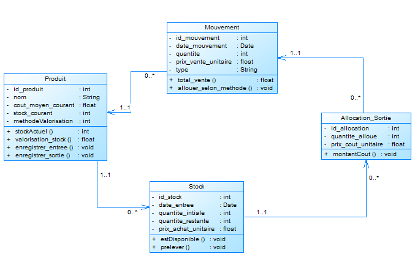
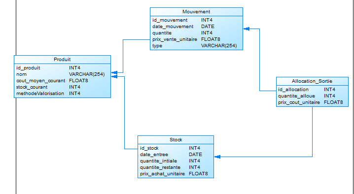

# 📦 Système de Gestion de Stock Django

Un système de gestion de stock robuste et traçable, conçu pour gérer efficacement les entrées et sorties de produits avec plusieurs méthodes de valorisation (FIFO, LIFO, Moyenne pondérée).

---

## 🎯 Objectif du Projet

Ce projet propose une solution complète pour la gestion de stock d'une entreprise. Il permet de :

- 📥 Suivre toutes les **entrées** et **sorties** de produits
- 📊 Gérer les **lots de stock** de manière individuelle
- 💰 Assurer la **traçabilité des coûts** et calculer les marges
- 🔄 Supporter différentes **méthodes de valorisation** selon les besoins

Le système a été pensé pour être flexible et s'adapter aux réalités terrain de la gestion de stock.

---

## 📐 Architecture du Modèle

Le système repose sur quatre entités principales qui travaillent ensemble pour assurer une gestion précise du stock :

### 📊 Diagrammes

**Modèle Conceptuel de Données (MCD)**



**Modèle Physique de Données (MPD)**



---

## 🗂️ Les Entités Principales

### 1️⃣ Produit

C'est la carte d'identité de chaque article géré dans le système.

**Attributs :**
- `id_produit` : Identifiant unique
- `nom` : Désignation du produit
- `cout_moyen_courant` : Coût moyen actuel (pour valorisation)
- `stock_courant` : Quantité totale disponible
- `methodeValorisation` : Méthode de calcul (1=FIFO, 2=LIFO, 3=Moyenne)

**Fonctionnalités clés :**
- Calcul automatique du stock disponible
- Valorisation du stock selon la méthode choisie
- Enregistrement des entrées et sorties

---

### 2️⃣ Stock (Lots)

Chaque réception de marchandise crée un lot distinct. Cela permet de suivre l'origine et le coût réel de chaque arrivage.

**Attributs :**
- `id_stock` : Identifiant du lot
- `date_entree` : Date de réception
- `quantite_initiale` : Quantité reçue
- `quantite_restante` : Quantité encore disponible
- `prix_achat_unitaire` : Coût à l'achat

**Pourquoi des lots ?**
Les lots permettent d'appliquer correctement les méthodes FIFO et LIFO, et de connaître le coût exact de chaque vente.

---

### 3️⃣ Mouvement

C'est l'historique de toutes les opérations effectuées sur le stock.

**Attributs :**
- `id_mouvement` : Identifiant unique
- `date_mouvement` : Date de l'opération
- `quantite` : Quantité concernée
- `prix_vente_unitaire` : Prix de vente (pour les sorties)
- `type` : Type d'opération (`ENTREE`, `SORTIE`)

Chaque mouvement est tracé et permet de reconstituer l'historique complet du stock.

---

### 4️⃣ Allocation_Sortie

C'est le pont entre une vente et les lots consommés. Cette table est essentielle pour la traçabilité.

**Attributs :**
- `id_allocation` : Identifiant unique
- `quantite_allouee` : Quantité prélevée sur ce lot
- `prix_cout_unitaire` : Coût unitaire du lot

**Exemple concret :**
Si vous vendez 10 unités et que vous avez 2 lots disponibles, l'allocation indique combien vient de chaque lot et à quel coût.

---

## 🔄 Relations Entre les Entités
```
Produit ──┬── (1,n) ──> Stock
          │
          └── (1,n) ──> Mouvement ──┬── (1,n) ──> Allocation_Sortie
                                     │
Stock ────────────────────────────── └── (1,n)
```

Ces relations garantissent qu'on peut toujours remonter de la vente au lot d'origine.

---

## 💡 Méthodes de Valorisation

Le système supporte trois méthodes de valorisation reconnues :

| Méthode | Description | Cas d'usage |
|---------|-------------|-------------|
| **FIFO** | Premier Entré, Premier Sorti | Produits périssables, rotation naturelle |
| **LIFO** | Dernier Entré, Premier Sorti | Produits non périssables, gestion fiscale |
| **Moyenne Pondérée** | Coût moyen actualisé | Produits homogènes, gestion simplifiée |

La méthode est définie au niveau du produit et appliquée automatiquement lors des sorties.

---

## 📝 Exemple Pratique : Produit "Gloria"

Voici un cas concret pour illustrer le fonctionnement :

| Date | Opération | Quantité | Prix unitaire | Action |
|------|-----------|----------|---------------|--------|
| 09/10 | Entrée | 5 | 2 000 F | Création lot A1 |
| 12/10 | Entrée | 5 | 4 500 F | Création lot A2 |
| 16/10 | Sortie | 6 | 4 000 F | Vente de 6 unités |

**Avec la méthode FIFO :**
- On consomme d'abord les 5 unités du lot A1 (2 000 F)
- Puis 1 unité du lot A2 (4 500 F)
- **Coût de revient** : (5 × 2 000) + (1 × 4 500) = **14 500 F**
- **Chiffre d'affaires** : 6 × 4 000 = **24 000 F**
- **Marge brute** : 24 000 - 14 500 = **9 500 F**

Stock restant : 4 unités du lot A2, valorisées à 18 000 F.

---

## ✅ Règles de Gestion et Contraintes

Pour garantir l'intégrité des données :

- ✔️ `quantite_restante` ne peut jamais être négative
- ✔️ `quantite_allouee` doit être strictement positive
- ✔️ `prix_achat_unitaire` doit être positif ou nul
- ✔️ Le type de mouvement doit être valide (`ENTREE`, `SORTIE`, `AJUSTEMENT`)
- ✔️ Un produit avec des mouvements ne peut pas être supprimé
- ✔️ La suppression d'un mouvement supprime ses allocations

---

## 🚀 Avantages du Système

| Aspect | Bénéfice |
|--------|----------|
| **🔍 Traçabilité** | Chaque vente est liée à ses lots d'origine |
| **🎨 Flexibilité** | Supporte FIFO, LIFO et Moyenne pondérée |
| **📈 Auditabilité** | Historique complet et vérifiable |
| **⚡ Performance** | Calculs directs sans retraitement massif |
| **🔧 Évolutivité** | Prêt pour multi-entrepôts, multi-utilisateurs |

---

## 🔮 Évolutions Possibles

Le modèle est conçu pour évoluer facilement :

- 🏢 **Multi-entrepôts** : Gérer plusieurs sites de stockage
- 👥 **Gestion des utilisateurs** : Tracer qui fait quoi
- 📋 **Ajustements d'inventaire** : Régularisations et corrections
- 🧾 **Module de facturation** : Intégration comptable
- 🔄 **Gestion des retours** : Retours clients et fournisseurs

---

## 🛠️ Technologies

- **Backend** : Django (Python)
- **Base de données** : PostgreSQL / SQLite
- **Architecture** : MVC (MTV en Django)

---

## Pilotage 

### Backlog

Un backlog produit est une liste hiérarchisée et dynamique de tout ce qui doit être fait pour un produit, incluant les nouvelles fonctionnalités, les améliorations, les corrections de bugs et les dettes techniques. C'est un artefact central de la méthode agile Scrum, géré par le Product Owner, qui sert de référence unique et flexible pour l'équipe de développement. Les éléments du backlog sont classés par ordre de priorité afin de déterminer les tâches à réaliser en premier.

#### Caractéristiques clés

**Liste hiérarchisée** : Les éléments sont ordonnés par priorité, les plus importants en haut de la liste.
**Contenu varié** : Il contient des fonctionnalités, des corrections de bugs, des améliorations techniques et des tâches d'exploration.
Responsabilité du Product Owner : C'est le Product Owner qui est responsable de sa tenue, de son évolution et de son enrichissement.
**Flexibilité** : Le backlog est un document vivant qui s'adapte aux changements, aux retours clients et aux nouvelles priorités.
**Planification** : Il sert de base pour créer le « backlog de sprint », qui est un sous-ensemble du backlog produit sélectionné pour une itération spécifique.

#### Pourquoi est-il important ?

Vision partagée : Il donne une vision claire de la direction à suivre pour l'équipe de développement et les parties prenantes.
Priorisation : Il permet de se concentrer sur les éléments qui apportent le plus de valeur à l'utilisateur et aux objectifs stratégiques de l'entreprise.
Gestion des exigences : Il centralise toutes les exigences et les demandes relatives au produit en un seul endroit.
Amélioration continue : Il permet de gérer et de prioriser la résolution des dettes techniques, qui peuvent autrement s'accumuler et ralentir le développement.

Un backlog produit est une liste hiérarchisée de tâches destinées à l'équipe de développement. Il est créé à partir de la feuille de route produit et de ses exigences. Les éléments les plus importants figurent en tête du backlog produit. Ainsi, l'équipe sait ce qu'elle doit livrer en priorité. L'équipe de développement ne suit pas le backlog au rythme du Product Owner et celui-ci n'impose pas de tâches à l'équipe de développement. Cette dernière récupère les tâches à réaliser dans le backlog produit en fonction de ses capacités, soit en continu (Kanban), soit par itération (Scrum).
